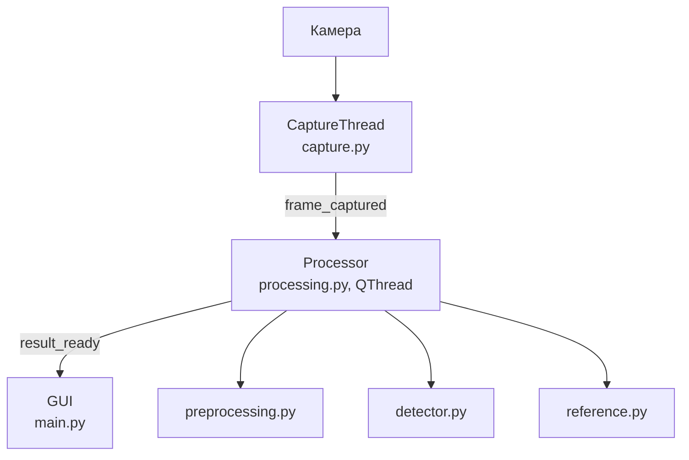
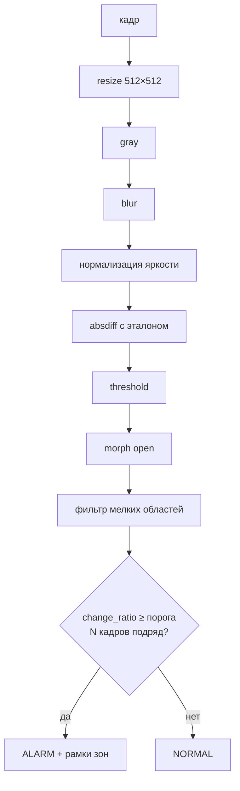

# rpi-vision

Система обнаружения изменений в кадре с камеры. Разработка ведётся на Windows
(USB-камера через OpenCV), целевая платформа — Raspberry Pi (CSI-камера через Picamera2).

## Как это работает





- Эталон — медиана `REFERENCE_FRAMES` кадров, задаётся кнопкой **Set reference**.
- **Detect change** — ручная проверка изменений по последним кадрам.
- Все параметры алгоритма — в `config.py`.

## Запуск (Windows / dev)

Требуется Python 3.14 и [uv](https://docs.astral.sh/uv/):

```
uv sync
uv run main.py
```

Камера выбирается в выпадающем списке в окне. Лог — `app.log` (очищается при каждом запуске).

## Запуск на Raspberry Pi

```
sudo apt install python3-picamera2 python3-opencv python3-pyside6.qtwidgets
uv venv --system-site-packages   # чтобы venv видел apt-пакеты
uv sync
uv run main.py
```

- `picamera2` и `opencv` ставим через apt: pip-сборки на ARM тяжёлые и конфликтуют с libcamera.
- В `config.py`: `CAMERA_BACKEND = "picamera2"` (или оставить `auto`) и `LOCK_CAMERA_PARAMS = True` — фиксация экспозиции/баланса белого (на Windows выключена: роняет FPS).
- Калибровка `PIXEL_THRESHOLD` / `MIN_AREA`: включить `DEBUG = True` — снимки этапов пайплайна сохраняются в `debug/`.
